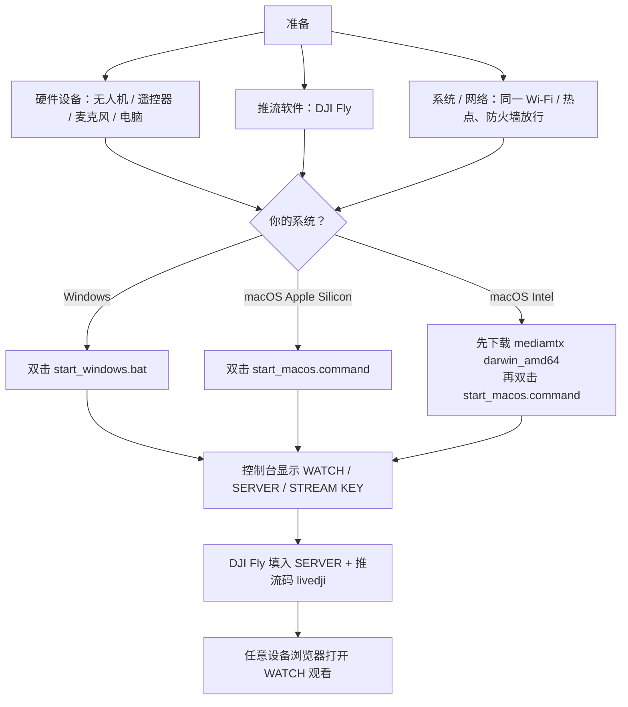

# dji-live

大疆无人机 RTMP 低延迟直播：**一键启动即可开播、观看**（Windows / macOS）。

> **免责声明**：本项目为第三方开源工具，与 DJI（大疆创新）官方无任何关联，未获其授权或认可。「DJI」「大疆」为深圳市大疆创新科技有限公司的注册商标。

## 为什么做这个

DJI Fly 自带「自定义 RTMP」推流，但官方只让你填一个地址——**服务端要自己搭**，对普通用户门槛很高。本项目把这件事压缩成「双击一个脚本」：

- **零依赖**：内置 MediaMTX 服务端，观看页用系统自带的 PowerShell / `nc` 托管，无需安装 Python / Node / Docker
- **一键启动**：控制台直接打印 DJI Fly 要填的地址和观看链接
- **自带观看页**：WebRTC 低延迟播放，带在线状态 / 时钟，浏览器打开即看
- **完整排障文档**：覆盖防火墙、「只有音频没视频」等常见坑

典型场景：飞无人机时让旁人用手机 / 平板实时看画面、活动现场把航拍画面投到大屏、局域网多设备同时观看——全程无需外网、无需直播平台账号。

## 项目特色：无需额外依赖

下载项目后即可运行，**不需要安装 Python、Node.js、npm、Docker 或其它开发环境**：

- Windows 使用系统自带的 PowerShell / .NET 托管观看页
- macOS 使用系统自带的 `nc`（netcat）托管观看页
- MediaMTX 服务端已随项目内置，无需单独安装
- 观看页不依赖 CDN、npm 或外部网络，局域网内即可使用

仅 **Intel Mac** 需额外下载对应版本，见下表。

## 组件就位情况

| 组件              | Windows   | macOS Apple Silicon | macOS Intel   |
| ----------------- | --------- | ------------------- | ------------- |
| MediaMTX 服务端   | ✅ 已内置 | ✅ 已内置           | ⬇️ 按需下载 |
| 观看页 / 启动脚本 | ✅ 已内置 | ✅ 已内置           | ✅ 已内置     |

> **macOS Intel 用户**：下载 `mediamtx_v1.20.1_darwin_amd64.tar.gz`（[官方 Releases](https://github.com/bluenviron/mediamtx/releases) v1.20.1），解压整个目录到 `server/mediamtx_v1.20.1_darwin_amd64/`；启动脚本自动识别芯片，无需改代码。

## 整体流程



## 快速开始

1. **启动**：Windows 双击 `start_windows.bat`；macOS 双击 `start_macos.command`（首次先 `chmod +x start_macos.command`）
2. 控制台打印所有地址（标注网络接口）：
   - `WATCH` → 打开观看直播
   - `SERVER` + `STREAM KEY` → 填入 DJI Fly
3. DJI Fly 填入地址与推流码（见下方「DJI Fly 配置」）
4. 任意设备浏览器打开 `WATCH` 地址观看

> 具体地址以控制台输出为准（每个 IP 标注了对应网络接口）。

## 首次使用准备

### 硬件设备

- **大疆无人机 + 遥控器**：DJI Fly 已安装；无人机需**连接 / 起飞**才有画面
- **麦克风**：Type-C 耳机 / 蓝牙耳机，**接入遥控器**才能开播
- **电脑**：运行直播服务端（Windows / macOS）
- **观看设备**：手机 / 平板 / 电脑，浏览器打开观看页

### 推流软件

- **DJI Fly**：遥控器上的大疆 App，内置 RTMP 推流；在**图传**设置里「自定义 RTMP」填入 SERVER + STREAM KEY 即可开播

### 系统准备

- **Gatekeeper（macOS）**：双击被拦截无法打开时，执行 `xattr -dr com.apple.quarantine start_macos.command`
- **防火墙**：首次运行弹窗点「允许」（macOS），或放行相关端口（Windows 见排障指南）
- **网络**：遥控器与电脑需**同一 Wi-Fi 或同一手机热点**（无需外网）

> **安全提示**：默认配置不校验推流 / 观看身份（MediaMTX `user: any` 无密码），适用于**可信局域网**。请勿将 1935 / 8080 / 8888 / 8889 等端口直接暴露到公网；确有公网需求时，先在 `server/mediamtx_v1.20.1_*_*/mediamtx.yml` 的 `authInternalUsers` 中配置用户名密码，或改用加密协议（RTMPS / WebRTC over HTTPS）。

## DJI Fly 配置（遥控器）

自定义 RTMP，两种填法等价，任选其一：

| 方式 | 服务器地址 | 推流码 |
| --- | --- | --- |
| A | `rtmp://<电脑IP>/`（不带端口号，默认 1935） | `livedji` |
| B | `rtmp://<电脑IP>/livedji` | 留空 |

- 电脑 IP 选遥控器所在网络的那个（控制台已标注接口）
- 两种写法均等价于 `rtmp://<电脑IP>:1935/livedji`

## 观看方式

| 方式                 | 地址                                        | 延迟                       |
| -------------------- | ------------------------------------------- | -------------------------- |
| 自定义观看页（推荐） | `http://<电脑IP>:8080/`                   | 低（含状态 / 时钟 / 署名） |
| WebRTC               | `http://<电脑IP>:8889/livedji`            | 最低                       |
| HLS                  | `http://<电脑IP>:8888/livedji/index.m3u8` | 最高                       |

- 本机用 `127.0.0.1`；其它设备用电脑局域网 IP（不能填 `127.0.0.1`）

### [VLC](https://images.videolan.org/vlc/index.zh_CN.html) 等播放器

VLC `Ctrl+N`（媒体 → 打开网络串流）粘贴地址：

| 场景   | RTMP（低延迟）                    | HLS（更稳）                                  |
| ------ | --------------------------------- | -------------------------------------------- |
| 本机   | `rtmp://127.0.0.1:1935/livedji` | `http://127.0.0.1:8888/livedji/index.m3u8` |
| 局域网 | `rtmp://<电脑IP>:1935/livedji`  | `http://<电脑IP>:8888/livedji/index.m3u8`  |

## 停止与后台运行

- 启动后服务在**后台常驻**：关闭启动窗口不影响推流与观看
- 再次双击启动脚本可重新查看地址，不会重复启动服务
- **全部停止**：双击 `stop_macos.command` / `stop_windows.bat`
- Windows 关闭启动窗口只停观看页，MediaMTX 仍在后台运行
- **重启电脑后**需重新双击启动脚本
- **排障日志**：`server/mediamtx.log`（Windows 另有 `mediamtx.err.log`）

## 常见问题

- **只有音频没视频**（日志 `1 track`）：无人机未起飞 / 相机未激活；DJI 端建议编码 H.264
- **VLC 无法打开**：该路径无活动推流，先确认遥控器已开播
- **延迟大**：用 WebRTC / 自定义观看页；降低图传清晰度 / 码率
- **遥控器提示检查 RTMP 地址 / 推流码**：见对应平台的防火墙与日志排障（[macOS](./docs/DJI_RTMP直播搭建与排障指南_macOS版.md) / [Windows](./docs/DJI_RTMP直播搭建与排障指南_Windows版.md)）

## 文件结构

```
RTPM/
├── start_windows.bat  ← Windows 一键启动（双击）
├── stop_windows.bat   ← Windows 一键停止（双击）
├── start_macos.command ← macOS 一键启动（双击）
├── stop_macos.command  ← macOS 一键停止（双击）
├── README.md / LICENSE
├── server/            ← 服务端（脚本自动管理）
│   ├── serve.ps1      ← Windows 启动逻辑
│   ├── stop.ps1       ← Windows 停止逻辑
│   ├── index.html     ← 观看页（状态 / 时钟 / 署名，自动隐藏）
│   ├── mediamtx.log   ← MediaMTX 日志（运行时生成，见「停止与后台运行」）
│   ├── mediamtx_v1.20.1_windows_amd64/          ← 已内置
│   └── mediamtx_v1.20.1_darwin_arm64/           ← 已内置（Apple Silicon）
└── docs/            ← 排障指南（见下方「文档」）
```

## 第三方组件

本项目内置了以下第三方组件，感谢其作者与社区：

| 组件 | 版本 | 许可证 | 说明 |
| --- | --- | --- | --- |
| [MediaMTX](https://github.com/bluenviron/mediamtx) | v1.20.1 | [MIT](https://github.com/bluenviron/mediamtx/blob/main/LICENSE) | 流媒体服务端，负责 RTMP 收流与 WebRTC / HLS 分发（各平台目录内已附带其 LICENSE） |

本项目自身代码与文档采用 [MIT License](./LICENSE)。

## 文档

- 详细搭建与排障（Windows）：[docs/DJI_RTMP直播搭建与排障指南_Windows版.md](./docs/DJI_RTMP直播搭建与排障指南_Windows版.md)
- 详细搭建与排障（macOS）：[docs/DJI_RTMP直播搭建与排障指南_macOS版.md](./docs/DJI_RTMP直播搭建与排障指南_macOS版.md)
